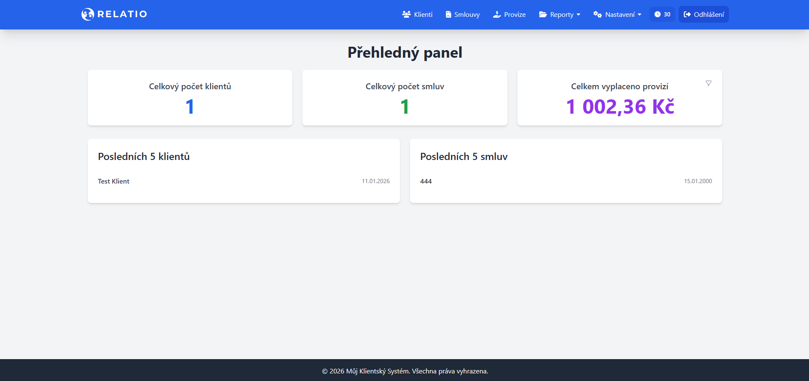

<h1 align="center">
   
    <a href="https://github.com/Honzous00/CRM">
      <picture>
        <source media="(prefers-color-scheme: dark)" srcset="https://raw.githubusercontent.com/Honzous00/CRM/refs/heads/main/public/images/logo/White.svg">
        <source media="(prefers-color-scheme: light)" srcset="https://raw.githubusercontent.com/Honzous00/CRM/refs/heads/main/public/images/logo/Color.svg">
        
      </picture>
    </a>
     
</h1>

  <a href="README.en.md">🇬🇧 English</a> •
  <a href="README.md">🇨🇿 Čeština</a> •

  

  
  
  

---

This project introduces a modular CRM system developed for the efficient management of clients, contracts, and financial commissions. The application emphasizes high data integrity, security, and a clean user interface based on modern web technologies.

## 📸 Preview

  

---

## Features

* **Comprehensive Entity Management**: Records of clients, insurance policies, products, and insurance carriers in an interconnected system.
* **Financial Overview**: Tracking of commissions, their statuses, and payment history.
* **Document Management**: Ability to upload and record attachments directly to individual contracts.
* **Access Control (RBAC)**: Differentiation of permissions between administrators and standard users.
* **Automated Installation**: Intuitive setup wizard for system and database configuration.

---

## Architecture

The system utilizes a three-tier architecture with a strict separation of the public layer from the application logic (MVC pattern).

* **Public Access Layer**: The single entry point of the application ensuring routing and security.
* **Application Core**: Backend logic in PHP divided into models (DAO), controllers, and views.
* **Data Layer**: MySQL/MariaDB database with enforced referential integrity.

Details can be found in: **[System Architecture](docs/architecture.en.md)**

---

## Installation

Installation requires an environment with **PHP 8.0+** and a **MySQL/MariaDB** database.

1. Upload the files to the server.
2. Run `install.php` in your browser and follow the instructions.
3. Upon completion, run the security script `remove_install.php?confirm=yes`.

Details can be found in: **[Installation Guide](docs/installation.en.md)**

---

## Project Structure

The directory structure is designed for maximum security and code clarity.

* `/app/`: Contains non-public logic, DB queries, and HTML templates.
* `/public/`: Contains executable scripts, client-side JavaScript, and CSS styles.
* `/docs/`: Technical documentation of the project.

Details can be found in: **[Project Structure](docs/project-structure.en.md)**

---

## Database

The data schema (file `muj_cms.sql`) consists of 7 main tables that ensure data consistency using foreign keys with `CASCADE` and `RESTRICT` rules.

Details can be found in: **[Database Guide](docs/database.en.md)**

---

## Security

Security is integrated across all layers of the system:

* **SQL Injection Protection**: Exclusive use of Prepared Statements.
* **Session Management**: Server-side timeout (35 min) synchronized with client-side disconnection.
* **Hardening**: `installed.lock` mechanism and self-cleaning installation scripts.

Details can be found in: **[Security Policy](docs/security.en.md)**

---

## Notes

* **Current Limitations**: In its current version, the system uses hardcoded database credentials in the `db_connect.php` file and does not yet support environment variables (`.env`).
* **Dependencies**: The UI utilizes external CDNs for Tailwind CSS and Font Awesome.
